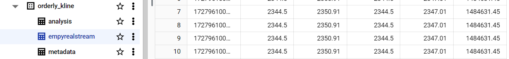
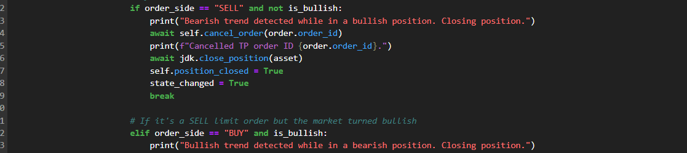

## agentXTransformers - [Orderly Network X GCP X Empyreal SDK Implementation]

**agentXtransformers** is an advanced machine learning-powered trading agent designed for margin trading on Orderly Network's decentralized order book. The implementation is *real-time*, *flexible*, and ***dynamic***, requiring only the creation of an Orderly account through its user-friendly interface.

***This is a walkthrough of the various components involved in its development:***

### Trading Strategy
-   The agent seeks to secure profits on a *short-term basis* by leveraging both upward and downward market trends.
-   Every 5 minutes, it streams OHLCV (Kline) data to a Vertex AI model in the cloud for ***market direction predictions***.
-   It incorporates multiple risk management strategies, including controls for over-trading, metrics calculation, and dynamic position sizing.
-   The agent trades on the **PERP_ETH_USDC** futures market through the **Orderly Orderbook (Testnet)**.

### *Step 1: LSTM Unsupervised ML Training for Market Prediction*

-   the first step is to train a suitable model. **Long Short-Term Memory (LSTM)** is an ideal machine learning technique for understanding temporal patterns in time series data, (*making it well-suited for financial trading data*).
-   the model was trained on **3 years of OHLCV data** **w/ 5-minute intervals**. This extensive dataset helps the model capture ***various market trends*** and long-term dependencies for ETH, which are essential for accurate predictions.

 

> since the goal is to trade on **Orderly Network's orderbook**, i've used a dataset with similar trading volume patterns to prevent bias and better generalization the real-world.

-   preprocessed the data using techniques (**scaling**, **normalization**), and generated **technical indicators** with different time windows to capture short-and-long term trends.

-   created sequences of 5 time steps for LSTM input, this means the model ***processes 5 consecutive data points*** to predict the next price movement. This allows the model to learn and forecast short-term trends.

> _the strategy focuses on short-term trend recognition. while adding longer sequeces could improve context, the trade off is slower reaction time and make it more reliant on older data._

-   Backtested the trained model on the validation set, (data timeline from 2024-06). Additionally, conducted backtesting on Orderly Network's Kline data over a 5-minute interval ***spanning just over 2 days***.

-   calculated several metrics, including **Mean Absolute Error** (MAE), ***R² Score***, and ***Mean Absolute Percentage Error*** (MAPE), to evaluate the model's predictive capabilities beyond just visual analysis.

### Step 2: GCP Data Pipeline and Event-Driven Automation

*I used the following GCP services to build a real-time, event-driven Data-to-Prediction pipeline:*

- **Pub/Sub:** enables seamless communication across the pipeline stages: from *Data Entry* to *Preprocessing*, *Prediction*, and *Data Upload*.

-   **Vertex AI:** deployed the predictive model to Vertex AI, making it available through a publicly accessible endpoint for inference.

-   **BigQuery:** set up buckets to stream Orderly Kline data into, ensuring the data is properly formatted and ready for querying before prediction.

-   **Cloud Functions:** connected the streaming data from the locally running agent to the cloud preprocessing service for real-time data handling.

 

### Overview of the Data Pipeline Integration W/ GCP
* the first step is to have a cloud run function that is ready to accept the OHLCV data from the Local running Agent. 
* after receiving the data, the function ***publishes*** 2 messages to different Pub Sub Topics. 
* the first Pub/Sub automatically pushes it to a Big Query table (which is a subscription) as long as the schema is correct.
* and the second notifies another service about the new data entry, which then *waits for the streaming buffer*, *queries the new dataset*, and fetches the required number of rows (30 in this case)

> **30 rows?** bcos we need 5 **time steps** for prediction, but a window of **over 20 rows** for calculating techical indicators.

-   finally, the data is sent to a **Flask app** deployed on GCP, which handles the preprocessing (*as was done during training*). The app prepares the sequences, sends them to the Vertex AI endpoint for inference, and retrieves the prediction.
-   the entire process, from receiving data to making predictions, takes less than 5 seconds.

> *i have given more timeframe(10) for the agent due to extra latency while sending and recieveing the requests.*

The extra benefits of this event driven implementation with GCP is that everything works in perfect sync, the completion of one process is what guarantees the start of  next. Furthermore, the agent controls the system.

### STEP 3: Integration with Empyreal SDK & Orderly Network
**Empyreal SDK** provides a *streamlined* way of interacting with Orderly Networks and Trading in ***RealTime Simulation***:

* **Market Sentiment Analysis(MSA):** calculated using the ***Fear & Greed Index*** on each trade loop, it is complemented with closer indicators of the SMA & EMA (5 and 10 data points resp) to filter the noise that might occur in the model's pred.

* **Dynamic Positons:** the scoring from MSA is used to create ***dynamic positon size*** (purchase amt) and *stop loss, take profit* prices for risk management.

* **Limit Market Orders** of Stop Loss (SL) & Take Profit (TP) using Empyreal SDKs and  ***Orderly Network's REST API***.

* **Monitor Trades**, the agent further *monitor open orders* and closes them when the market moves against by a percentage. This works for both **BUY** and **SELL** limits.

* **Tracking Volatility**: (*eth can be highly volatile sometimes*), the **agent + model combo** struggles to make successful trade, so it can ***detect this and halt trading*** (only) for the time volatility lasts.

* the agent places trades from the ***joint decision weighting*** of model's prediction and market sentiment. this is compared against a *threshold* that if met, orders are placed.

**Link to the Agent Strategy: [agent-xtransformer Jupyter Notebook](https://github.com/chel-007/agentXTransformers-RealTime-EventDriven-AI-Trading-on-OrderlyNet/blob/master/Empyreal%20SDK%20in%20Action%20-%20AIEventDrivenStrategy.ipynb)**

#### **Risk Management Implementations & Performance Tracking:**

<table>
  <tr>
    <td>
        
      <h4>Example Risk Management - Sharpe Calc Over 10 Trades etc.</h4>
    </td>
    <td>
        
      <h4>Market Volatility Triggers - The Yellow Highlight Shows the Movement</h4>
    </td>
    <td>
        
      <h4>Final Backtest Orderly w/ Model</h4>
    </td>
  </tr>
</table>

## How to setUp & Deploy the Strategy

1. **run the command** - this provides easy access to the project `git clone https://github.com/chel-007/agentXTransformers-RealTime-EventDriven-AI-Trading-on-OrderlyNet.git`

2. the strategy is best executed in a **jupyter anaconda notebook** due to the nature of the code, it is not recommended to run it in a standalone python script.

3. download **Anacoconda** and run the followquing commands in the Anaconda Prompt:
    * `conda create --name agentxtransformers python=3.12.4`
    * `conda activate agentxTransformers`

4. Launch Jupyter and navigate to the project directory. Open the notebook `Empyreal SDK in Action - AIEventDrivenStrategy.ipynb`.

5. Install the required dependencies by running the Pip cell once OR `pip install -r requirements.txt`

<!-- ("if u face an antivirus error, consider deactivating your antivirus") -->

6. the notebook is divided into 3 parts:
    * `Global Initialization - set up global functions and your Orderly account details`.
    * `AIEventDrivenStrategy - run the strategy logic`.
    * `Agent Controls - access, start, and stop the trading agent`.

7. **Orderly Acct Setup:** follow the instructions in the notebook to obtain your **Orderly Acct key** and **Orderly Network Account ID**

8. **Uncomment the service key json `keypath`**

9. Trading access mechanism: 
    * only one client can run the strategy at a time.
    * running the cells creates a  **lock** on the strategy, to prevent multiple clients
    * the lock is stored in **GCP cloud bucket**
    * ensure to **release the lock** by running the `release_lock()` function when ure donw.

10. if you do not run the cells in sync, it is recommended to **restart the kernel** to ensure proper functioning. running the cells in sequence is highly recommended.

> Courtesy of the bounty Sponsored BY: [**Orderly Network** X **GCP** x **StackUP**](https://earn.stackup.dev/campaigns/unleashing-the-power-of-ai-trading-agents/quests/orderly-network-x-google-cloud-bounty-unleashing-the-power-of-ai-trading-agents-43d3)
> 
> 
> Written with [StackEdit](https://stackedit.io/).
